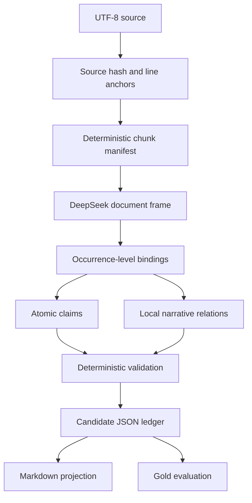

# Research Semantic Ledger

> Auditable extraction of atomic claims and narrative relations from long-form research documents.

Research Semantic Ledger turns UTF-8 research text into an evidence-linked JSON candidate ledger and a human-readable Markdown projection. The workflow builds a document frame before chunk extraction, resolves references occurrence by occurrence, keeps claims atomic, uses a closed narrative-relation vocabulary, validates exact evidence, and never writes to a formal database.

## Five-minute Agent start

Requirements: Git and Python 3.11 or newer. Synthetic conformance and extraction preflight have no third-party dependencies and need no API key.

```bash
git clone https://github.com/Eric871/research-semantic-ledger.git
cd research-semantic-ledger
python -m research_semantic_ledger doctor
python -m research_semantic_ledger validate examples/synthetic-extracted-ledger.json
python -m research_semantic_ledger evaluate examples/synthetic-extracted-ledger.json --gold examples/synthetic-extraction-gold.json
python -m research_semantic_ledger render examples/synthetic-extracted-ledger.json --output outputs/example.md
python -m unittest discover -s tests -v
```

Coding agents should read [`AGENTS.md`](AGENTS.md) automatically; `CLAUDE.md` points Claude Code to the same guide. A copyable onboarding prompt is available in [`AGENT_HANDOFF.md`](AGENT_HANDOFF.md).

## Run a new document

Start with a no-network preflight. It freezes source hashes, line anchors, chunk boundaries, Prompt hashes, the requested model, and the call ceiling.

```bash
python -m research_semantic_ledger extract path/to/document.md --dry-run
```

Inspect the generated `run-manifest.json` and `source-manifest.json`. Online extraction is allowed only after the source owner has authorized sending the document to the configured provider.

PowerShell:

```powershell
$env:DEEPSEEK_API_KEY = "your-runtime-key"
python -m research_semantic_ledger extract path/to/document.md `
  --authorize-external-send `
  --model deepseek-v4-flash `
  --max-calls 100
```

Bash:

```bash
export DEEPSEEK_API_KEY="your-runtime-key"
python -m research_semantic_ledger extract path/to/document.md \
  --authorize-external-send \
  --model deepseek-v4-flash \
  --max-calls 100
```

The default endpoint is `https://api.deepseek.com/chat/completions`. Override it with `DEEPSEEK_BASE_URL` or `--endpoint`. The adapter requires HTTPS, explicitly disables DeepSeek V4 thinking mode so the final JSON is returned in `message.content`, requests one JSON object, uses temperature zero, and never performs an automatic retry.

To enforce a monetary ceiling, pass the current provider prices explicitly so the repository does not pretend that a stale hard-coded price is authoritative:

```bash
python -m research_semantic_ledger extract path/to/document.md \
  --authorize-external-send \
  --max-cost-cny 10 \
  --input-price-cny-per-million <CURRENT_INPUT_PRICE> \
  --output-price-cny-per-million <CURRENT_OUTPUT_PRICE>
```

Every online run stores source-bearing requests and provider responses under its ignored `outputs/` directory. Do not commit that directory.

If a prior run produced a valid `document-frame.json` but failed later, reuse that frozen frame without purchasing it again:

```bash
python -m research_semantic_ledger extract path/to/document.md \
  --authorize-external-send \
  --reuse-document-frame path/to/prior/document-frame.json
```

The reused frame is validated against the current source and its artifact hash is recorded in lineage.

To resume an interrupted run without repurchasing successful calls, provide one
or more prior run directories. A response is replayed only when the system
prompt and canonical JSON request payload match exactly; every miss is sent to
the configured provider as a new paid call.

```bash
python -m research_semantic_ledger extract path/to/document.md \
  --authorize-external-send \
  --replay-successful-calls path/to/prior/run
```

Replay calls have zero billable usage in the resumed run while preserving the
original usage in the receipt for audit. The manifest reports replayed and
external calls separately.

## Outputs

Successful extraction emits:

- `run-manifest.json` — source, Prompt, model, chunk, authorization, and budget lineage;
- `source-manifest.json` — immutable normalized source lines and hashes;
- `document-frame.json` — entity, event, role, segment, and time-anchor candidates;
- `raw/call-*.json` — local request/response receipts for replay and audit;
- `candidate-ledger.json` — canonical machine-readable candidate ledger;
- `validation.json` — deterministic fail-closed validation receipt;
- `candidate-ledger.md` — deterministic human-readable projection.

JSON remains the source of truth. Markdown is a derived view and should not be edited as canonical data.

## Pipeline



The public online tier is deliberately conservative:

- every source-bearing provider call requires `--authorize-external-send`;
- documents exceeding the configured context boundary fail before transmission;
- chunks exceeding 24 claims must request a deterministic split instead of truncating;
- unresolved references remain unresolved rather than being force-bound;
- evidence quotes must be exact substrings of cited lines;
- relations use only `causes`, `enables`, `constrains`, `qualifies`, `depends_on`, `compares`, `contrasts`, `supports`, `precedes`, `elaborates`, or `exemplifies`;
- invalid candidates fail closed and remain outside any formal database.

## Prompts and Gold

The complete public Prompt contracts are versioned with the code:

- [`document-frame-v0.1.txt`](research_semantic_ledger/prompts/document-frame-v0.1.txt)
- [`chunk-extraction-v0.1.txt`](research_semantic_ledger/prompts/chunk-extraction-v0.1.txt)

The public-safe Gold workflow is demonstrated by:

- [`synthetic-research-note.md`](examples/synthetic-research-note.md)
- [`synthetic-extracted-ledger.json`](examples/synthetic-extracted-ledger.json)
- [`synthetic-extraction-gold.json`](examples/synthetic-extraction-gold.json)

Human Gold tied to licensed documents remains private. The public Gold demonstrates the evaluation contract and failure behavior, not production accuracy.

## Reproducibility levels

1. **Synthetic conformance** — validators, renderer, public Gold, and tests; no credentials.
2. **Extraction preflight** — source and chunk manifests; no external transmission.
3. **Online DeepSeek extraction** — explicitly authorized, source-bearing, nondeterministic provider inference with preserved receipts.
4. **Private semantic audit** — licensed source, human Gold, audit batches, and reviewer decisions outside the public repository.

See [REPRODUCIBILITY.md](REPRODUCIBILITY.md) and [SECURITY_AND_DATA.md](SECURITY_AND_DATA.md).

## Current evidence and maturity

The principal internal experiment processed one frozen 239-line expert transcript with 54 question-and-answer units. It produced 474 atomic candidates and 139 narrative-relation candidates. Structural and evidence gates passed 8/8, the domain-specific regression passed 7/7, and the provider semantic Gold result was 5/9. An unblinded 9/9 adjudication overlay is mechanism-design evidence only and is not an independent provider score.

Therefore:

- source anchoring, candidate assembly, validation, replay receipts, and Markdown rendering are implemented;
- public synthetic conformance is reproducible;
- online DeepSeek extraction is now runnable but provider output remains nondeterministic;
- general semantic accuracy across unseen documents, complete document-level narrative organization, cross-document reconciliation, automatic promotion, and production readiness remain unproven.

## Security boundary

Never commit API keys, licensed source text, source-bearing provider payloads, private Gold, audit databases, reviewer identities, or generated `outputs/`. The Apache-2.0 license covers only files actually distributed in this repository.

## License

Licensed under the Apache License 2.0.
