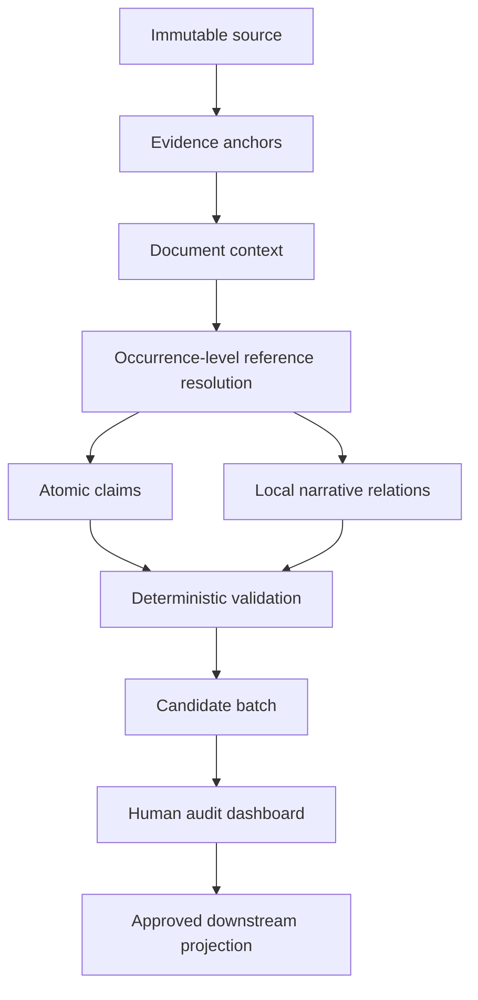

# Research Semantic Ledger

> Auditable extraction of atomic claims and narrative relations from long-form research documents.

Research Semantic Ledger is an experimental, evidence-first pipeline for turning research transcripts and reports into reviewable semantic candidates. It preserves source anchors, resolves document context occurrence by occurrence, extracts atomic claims and local narrative relations, applies deterministic quality gates, and routes every candidate to a human audit interface before promotion.

## Five-minute Agent start

Requirements: Git and Python 3.11 or newer. The public workflow has no third-party dependencies and needs no API key.

```bash
git clone https://github.com/Eric871/research-semantic-ledger.git
cd research-semantic-ledger
python -m research_semantic_ledger doctor
python -m research_semantic_ledger summary examples/synthetic-group-reference.json
python -m unittest discover -s tests -v
```

Coding agents should read [`AGENTS.md`](AGENTS.md) automatically; `CLAUDE.md` points Claude Code to the same guide. A copyable onboarding prompt is available in [`AGENT_HANDOFF.md`](AGENT_HANDOFF.md).

The checkout works immediately for fixture validation, structural summaries, environment diagnosis, and dependency-free regression tests. Private full-document extraction, provider calls, audit data, and database promotion are separate capability tiers and are not silently enabled.

## Why this project exists

Conventional retrieval pipelines can find relevant paragraphs while still losing critical meaning:

- pronouns and generic company references may bind to the wrong entity;
- facts, forecasts, assumptions, and conclusions may be flattened together;
- numeric facts may survive while the comparison or causal argument disappears;
- structurally valid JSON may still be semantically wrong.

This project treats those failures as observable workflow states rather than hidden model errors.

## Pipeline



Formal database promotion is outside the current MVP. Candidate generation and audit remain separate.

## Current evidence

The principal internal experiment processed one frozen 239-line expert transcript containing 54 question-and-answer units:

| Measure | Result |
|---|---:|
| Coverage cues | 257/257 |
| Reference/time occurrences in the paid input | 220 |
| Atomic claim candidates after deterministic rebuild | 474 |
| Local narrative relation candidates | 139 |
| Structural and evidence checks | 8/8 |
| Domain-specific FCC regression checks | 7/7 |
| Provider semantic Gold | 5/9 |
| Unblinded local adjudication overlay | 9/9 |
| Total provider cost | CNY 6.94910656 |
| Formal database writes | 0 |

The 9/9 overlay is explicitly **not** an independent model result: it was produced after provider errors and Gold criteria were visible. It is mechanism-design evidence only.

These are aggregate internal experiment results. The licensed source, provider payloads, and Gold needed to audit them are not included in the minimal public export; the public repository therefore reproduces the semantic contract and gates, not these model-quality scores.

## Safe public example

The repository includes a fully synthetic entity-set fixture under [`examples/`](examples/). It demonstrates the public contract without distributing licensed research text.

## Reproducibility levels

1. **Synthetic conformance** — dependency-free and safe to run publicly.
2. **Internal offline replay** — rebuilds validation and audit artifacts from preserved provider responses; requires the private artifact pack.
3. **Online provider replay** — reproduces the request contract and evaluation procedure, but external model output is not expected to be byte-identical.

See [REPRODUCIBILITY.md](REPRODUCIBILITY.md) and [SECURITY_AND_DATA.md](SECURITY_AND_DATA.md).

## License

Licensed under the [Apache License 2.0](LICENSE).

## Maturity boundary

Validated within the named single-document experiment:

- immutable source anchoring;
- occurrence-level context resolution;
- atomic-claim and local-relation candidate production;
- deterministic structural, evidence, entity-set consistency, cost, and replay gates;
- versioned human-audit batches.

Not yet established:

- general accuracy across industries;
- complete document-level narrative organization;
- cross-document reconciliation and retrieval utility;
- blinded provider parity;
- automatic promotion or production readiness.

## Repository status

This is the validated minimal public export for [`Eric871/research-semantic-ledger`](https://github.com/Eric871/research-semantic-ledger). Initial commit [`0117566`](https://github.com/Eric871/research-semantic-ledger/commit/011756617999244bf52236f368345b53a845c1ae) was published on 2026-09-01 and its [conformance workflow](https://github.com/Eric871/research-semantic-ledger/actions/runs/33460073495) passed. The export contains only documentation, a synthetic conformance fixture, a dependency-free validator, and CI; internal source text, provider payloads, Gold, audit data, and experimental runners remain outside it.
